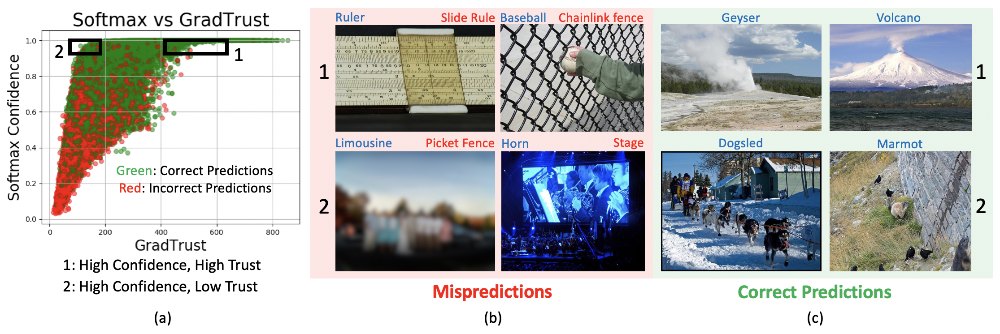
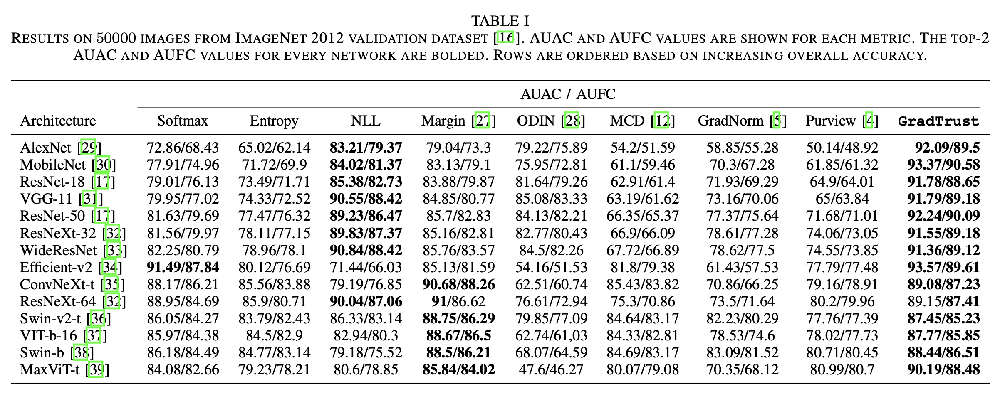

# GradTrust
[MIPR 2024 Invited] Code for the paper: Counterfactual Gradients-based Quantification of Prediction Trust in Neural Networks

Scatter plot between the proposed GradTrust on x-axis and softmax confidence on y-axis on ImageNet validation dataset using ResNet-18. Green points indicate correctly classified data and red indicates misclassified data. Representative misclassified and correctly images in the numbered boxes are displayed alongside the scatterplot, with their predictions (in red) and labels (in blue).
## Abstract
he widespread adoption of deep neural networks in machine learning calls for an objective quantification of esoteric trust. In this paper we propose **GradTrust**, a classification trust measure for large-scale neural networks at inference. The proposed method utilizes variance of counterfactual gradients, i.e. the required changes in the network parameters if the label were different. We show that GradTrust is superior to existing techniques for detecting misprediction rates on 50000 images from ImageNet validation dataset. Depending on the network, GradTrust detects images where either the ground truth is incorrect or ambiguous, or the classes are co-occurring. We extend GradTrust to Video Action Recognition on Kinetics-400 dataset. We showcase results on 14 architectures pretrained on ImageNet and 5 architectures pretrained on Kinetics-400. We observe the following: (i) simple methodologies like negative log likelihood and margin classifiers outperform state-of-the-art uncertainty and out-of-distribution detection techniques for misprediction rates, and (ii) the proposed GradTrust is in the Top-2 performing methods on 37 of the considered 38 experimental modalities.

## Results
### Quantitative Results

Results on 50000 images from ImageNet 2012 validation dataset. AUAC and AUFC values are shown for each metric. The top-2 AUAC and AUFC values for every network are bolded. Rows are ordered based on increasing overall accuracy.

### Qualitative Results

Qualitative analysis of mispredictions on AlexNet (top row), MaxVit-t (middle row) and ensemble mispredictions across all networks (bottom row). All displayed images have high softmax and ordered in ascending order of GradTrust.

